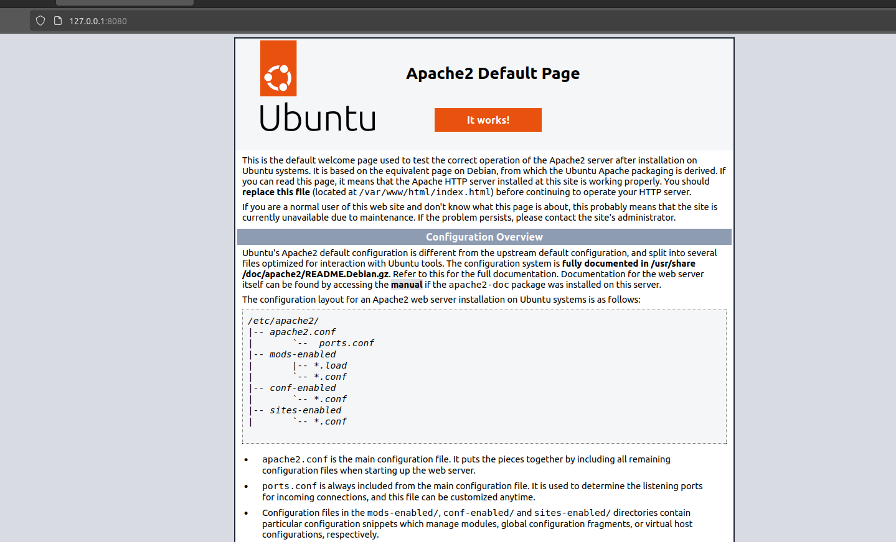
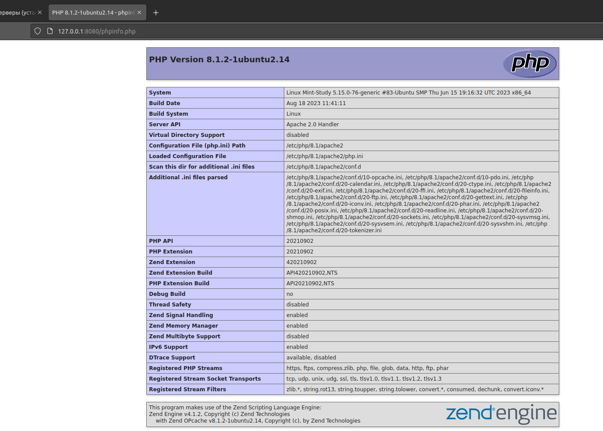
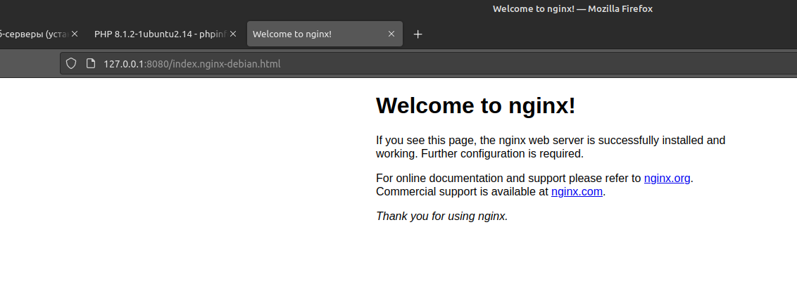
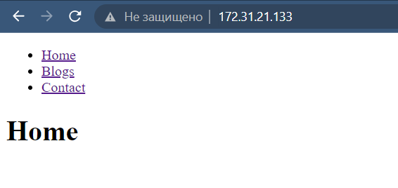
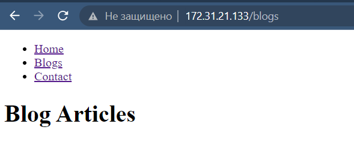
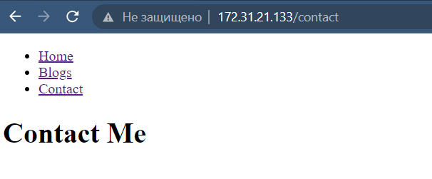

## 1. Установить Apache веб-сервер на VM и настроить его на работу с PHP (например, как указано в инструкции. Поменять порт по умолчанию на 8080. Убедиться, что Apache работает и возвращает страницу с информацией о PHP.


## 2. Установить Nginx на VM.
```
dmitry@Mint-Study:~$ sudo apt install nginx
```

## 3. Скопировать папку https://github.com/tms-dos17-onl/_sandbox/tree/main/lecture15/react_nginx/build на VM и настроить Nginx на хостинг этого веб-приложения. Проверить работоспособность приложения путем посещения всех доступных ссылок на главной странице и обновления каждой из страниц в веб-браузере.



## 4. Скопировать папку https://github.com/tms-dos17-onl/_sandbox/tree/main/lecture15/api на VM и запустить Python REST Api приложение согласно инструкции. Проверить работоспособность всех доступных REST Api методов с помощью Swagger.
```

```
## 5. Настроить Nginx как Reverse Proxy для Python REST Api приложения из предыдущего пункта. А затем:
- Открыть Swagger для веб-приложения через Nginx (http://<NGINX_IP>:<NGINX_PORT>/apidocs).
- Проверить работоспособность всех доступных REST Api методов через Nginx с помощью Swagger. Убедиться, что нет ошибок ни в выводе Rest Api приложения, ни в HTTP ответе в Swagger. При необходимости поправить конфигурацию Nginx сервера, чтобы все методы работали.
- Для тестирования метода /uploadFile использовать файл размером больше 1MB.
- Вывести в консоль содержимое файла конфигурации Nginx с измененными значениями и комментариями. 
```

```