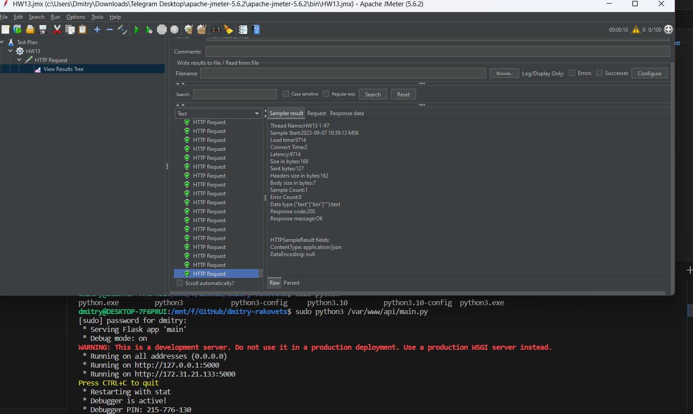
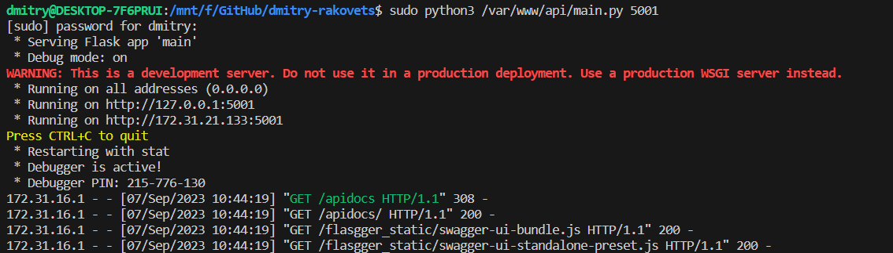
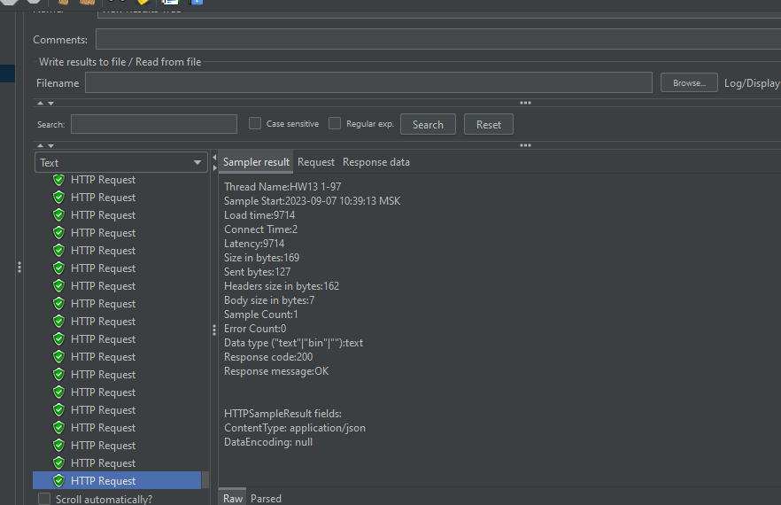
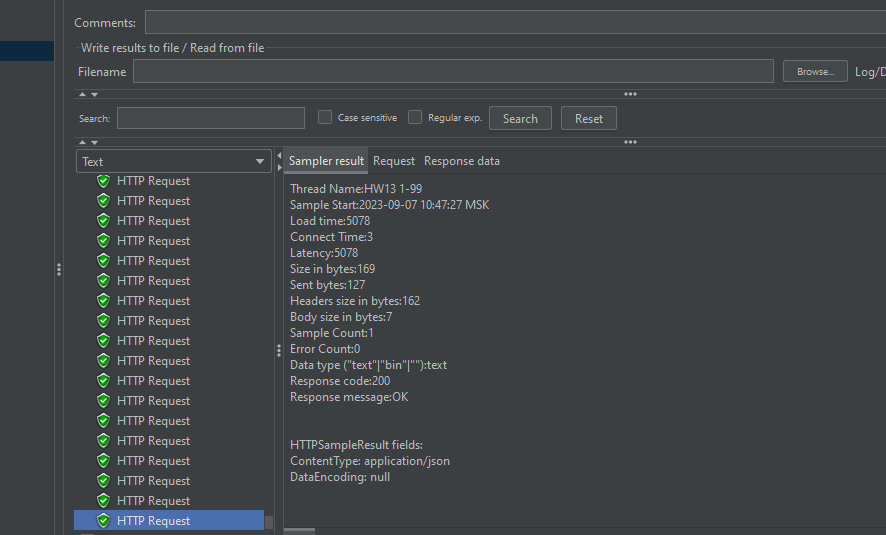

## 1. Скопировать папку https://github.com/tms-dos17-onl/_sandbox/tree/main/lecture15/api на VM и запустить Python REST Api приложение согласно инструкции. Проверить работоспособность всех доступных REST Api методов с помощью Swagger.
```
Сделал в  дз №12
```
## 2. Установить Nginx на VM и настроить его как Reverse Proxy для Python REST Api приложения из предыдущего пункта.
```
Сделал в  дз №12
```
## 3. Установить JMeter и написать тестовый сценарий для проверки производительности приложения путем выполнения HTTP GET запроса http://<NGINX_IP>:<NGINX_PORT>/ping от 100 пользователей.
```

```
## 4. Запустить ещё один экземпляр Python REST Api приложения на другом порту.

## 5. Изменить конфигурацию Nginx, чтобы он использовал в качестве бэкенда 2 приложения.
```
upstream site{
        server 127.0.0.1:5000;
        server 127.0.0.1:5001;

        root /var/www/api;
        index index.php index.html;

        location / {
                proxy_pass          http://site;
            rewrite /(.*) /$1 break;
            client_max_body_size 100M;
            proxy_read_timeout 90s;
            proxy_set_header    Host $host;
            proxy_set_header    X-Real-IP $remote_addr;
            proxy_set_header    X-Forwarded-For $proxy_add_x_forwarded_for;
            proxy_set_header    X-Forwarded-Proto $scheme;
        }
}
```
## 6. Повторить JMeter сценарий и сравнить результаты.


