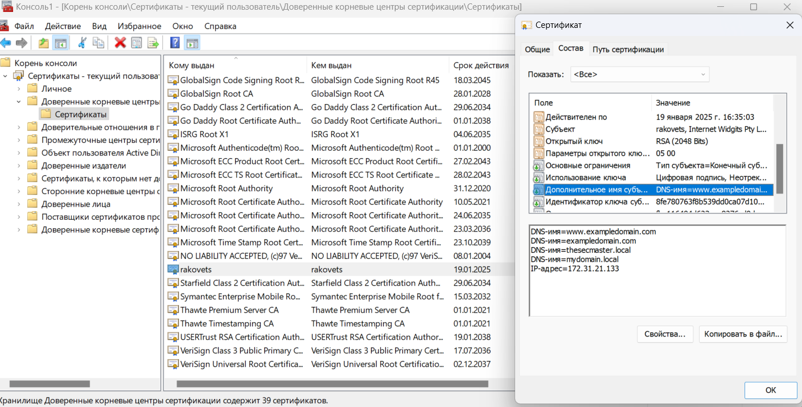
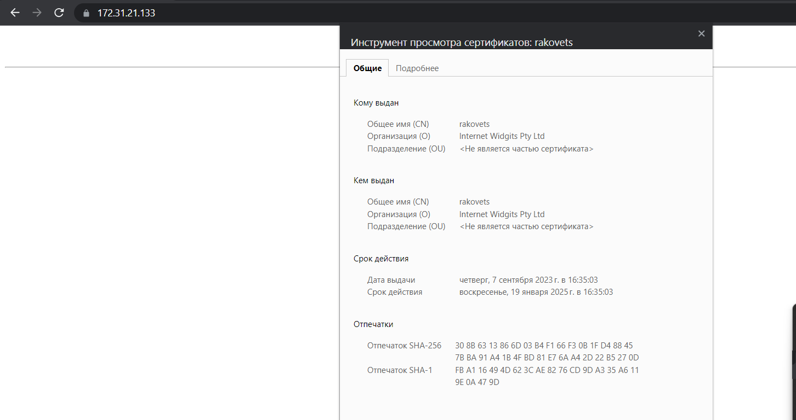

## 1. Сгенерировать пару ключей/сертификатов (private.pem и public.pem) при помощи OpenSSL
```
dmitry@DESKTOP-7F6PRUI:~$ openssl genrsa -out private.pem 2048
dmitry@DESKTOP-7F6PRUI:~$ openssl rsa -in private.pem -out public.pem -outform PEM -pubout
dmitry@DESKTOP-7F6PRUI:~$ ls
private.pem  public.pem
```
## 2. Создать скрипт encrypt.sh, который считывает стандартный поток ввода, шифрует его при помощи public.pem через OpenSSL и выводит в стандартный поток вывода.
```
dmitry@DESKTOP-7F6PRUI:~$ cat ./encrypt.sh
#!/bin/bash

openssl rsautl -encrypt -pubin -inkey public.pem

dmitry@DESKTOP-7F6PRUI:~$ cat text.txt | ./encrypt.sh 
       9S�{��p��X_��"^X^j�Tm�6��ؼh��My�)Ģ�    gڛ��r(Q�-�ڰ�h
                                                             1�Dl��w��I��D�q˜�Vdx]�@j5�"�=�[�k��υ�������QO��
                                                                                                                 ֥ʔ�ѧ��m�����P�0�B0F9���Xc�-�A�J,   ,�B��ը�
      ���G�&c!�*�v.y�p�?ܬ�������p�(l+�A��+�3Ng3FE�ƴ��N�I�By�J����m�h�%W��
z8[N��-m�Q+��8
```
## 3. Создать скрипт decrypt.sh, который считывает стандартный поток ввода, расшифровывает его при помощи private.pem через OpenSSL и выводит в стандартный поток вывода.
```
dmitry@DESKTOP-7F6PRUI:~$ cat decrypt.sh
#!/bin/bash

openssl pkeyutl -decrypt -inkey private.pem

dmitry@DESKTOP-7F6PRUI:~$ cat text.txt | ./encrypt.sh | ./decrypt.sh
Hello DevOps
```
## 4. Сгенерировать публичный сертификат public-nginx.pem для private.pem через OpenSSL, используя <LASTNAME>.io в качестве Common Name (CN).
```
dmitry@DESKTOP-7F6PRUI:~/hw14$ cat openssl.cnf
[ req ]
x509_extensions = v3_ca # The extensions to add to the self signed cert
..
[ v3_req ]
subjectAltName = @alt_names
..
[ alt_names ]
DNS.1 = www.exampledomain.com
DNS.2 = exampledomain.com
DNS.3 = thesecmaster.local
DNS.4 = mydomain.local
IP.0 = 172.31.21.133


dmitry@DESKTOP-7F6PRUI:~/hw14$ openssl req -x509 -new -key private.key -out public-nginx.pem -days 500 -nodes -extensions v3_req -config openssl.cnf
```
## 5. Настроить Nginx на работу по HTTPS, используя сертификаты из предыдущего задания. Например, чтобы Nginx возвращал домашнюю страницу по HTTPS.
```
dmitry@DESKTOP-7F6PRUI:~/hw14$ cat /etc/nginx/sites-available/default
upstream site{
        server 127.0.0.1:5000;
        server 127.0.0.1:5001;
}
server {
        listen 8080;
        listen [::]:8080;

        listen 443 ssl default_server;
        listen [::]:443 ssl default_server;


        ssl_certificate /etc/ssl/certs/nginx/public-nginx.pem;
        ssl_certificate_key     /etc/ssl/certs/nginx/private.key;

        server_name _;

        root /var/www/html;
        index index.php index.html;

        location / {
                proxy_pass          http://site;
            rewrite /(.*) /$1 break;
            client_max_body_size 100M;
            proxy_read_timeout 90s;
            proxy_set_header    Host $host;
            proxy_set_header    X-Real-IP $remote_addr;
            proxy_set_header    X-Forwarded-For $proxy_add_x_forwarded_for;
            proxy_set_header    X-Forwarded-Proto $scheme;
        }
}
```
## 6. Настроить доверие публичному сертификату в браузере и проверить это.


## 7. А теперь открыть домашнюю страницу Nginx по HTTPS через curl не прибегая к опции -k.
```
PS F:\GitHub\dmitry-rakovets\HW14> curl.exe https://172.31.21.133/apidocs
<!doctype html>
<html lang=en>
<title>Redirecting...</title>
<h1>Redirecting...</h1>
<p>You should be redirected automatically to the target URL: <a href="http://172.31.21.133/apidocs/">http://172.31.21.133/apidocs/</a>. If not, click the link.
```