## 1. Установить MySQL на VM.
```
dmitry@DESKTOP-7F6PRUI:~$ sudo apt install mysql-server
dmitry@DESKTOP-7F6PRUI:~$ sudo systemctl start mysql.service
dmitry@DESKTOP-7F6PRUI:~$ sudo mysql
mysql> ALTER USER 'root'@'localhost' IDENTIFIED WITH mysql_native_password BY '*****';
Query OK, 0 rows affected (0.32 sec)
mysql> exit
dmitry@DESKTOP-7F6PRUI:~$ mysql -u root -p
mysql> ALTER USER 'root'@'localhost' IDENTIFIED WITH auth_socket;
```
```
dmitry@DESKTOP-7F6PRUI:~$ sudo mysql_secure_installation

Securing the MySQL server deployment.

Connecting to MySQL using a blank password.

VALIDATE PASSWORD COMPONENT can be used to test passwords
and improve security. It checks the strength of password
and allows the users to set only those passwords which are
secure enough. Would you like to setup VALIDATE PASSWORD component?

Press y|Y for Yes, any other key for No: y

There are three levels of password validation policy:

LOW    Length >= 8
MEDIUM Length >= 8, numeric, mixed case, and special characters
STRONG Length >= 8, numeric, mixed case, special characters and dictionary                  file

Please enter 0 = LOW, 1 = MEDIUM and 2 = STRONG: 0

Skipping password set for root as authentication with auth_socket is used by default.
If you would like to use password authentication instead, this can be done with the "ALTER_USER" command.
See https://dev.mysql.com/doc/refman/8.0/en/alter-user.html#alter-user-password-management for more information.

By default, a MySQL installation has an anonymous user,
allowing anyone to log into MySQL without having to have
a user account created for them. This is intended only for
testing, and to make the installation go a bit smoother.
You should remove them before moving into a production
environment.

Remove anonymous users? (Press y|Y for Yes, any other key for No) : n

 ... skipping.


Normally, root should only be allowed to connect from
'localhost'. This ensures that someone cannot guess at
the root password from the network.

Disallow root login remotely? (Press y|Y for Yes, any other key for No) : n

 ... skipping.
By default, MySQL comes with a database named 'test' that
anyone can access. This is also intended only for testing,
and should be removed before moving into a production
environment.


Remove test database and access to it? (Press y|Y for Yes, any other key for No) : n

 ... skipping.
Reloading the privilege tables will ensure that all changes
made so far will take effect immediately.

Reload privilege tables now? (Press y|Y for Yes, any other key for No) : y
Success.

All done!
```
## 2. (**) Настроить Multi-Primary репликацию для MySQL на 2 VM согласно инструкции.

## 3. Создать схему БД clinic и наполнить её данными используя скрипты из https://github.com/tms-dos17-onl/_sandbox/tree/main/lecture18/mysql/initdb.d/data.
```
sudo cp -r /mnt/f/GitHub/_sandbox/lecture18/mysql/initdb.d/data /home/dmitry/
mysql> source /home/dmitry/data/schema.sql
Database changed
mysql> use clinic
Database changed

mysql> show tables;
+------------------+
| Tables_in_clinic |
+------------------+
| Appointment      |
| Department       |
| Doctor           |
| Job              |
| Patient          |
| Room             |
+------------------+

mysql> source /home/dmitry/data/data.sql
```
## 4. Создать бэкап базы данных clinic.
```
dmitry@DESKTOP-7F6PRUI:~$ sudo mysqldump -u root -p clinic > /mnt/f/clinic_backup.sql
```
## 5. Написать следующие SQL запросы:
- Вывести всех врачей, работающих в терапевтическом отделении.
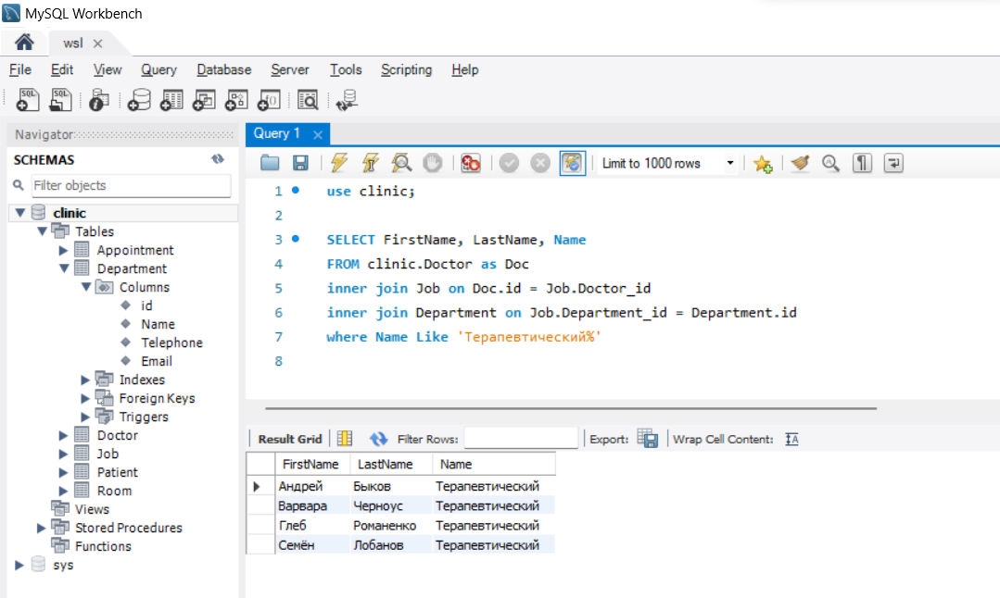
- Вывести в каких отделениях побывал каждый пациент.
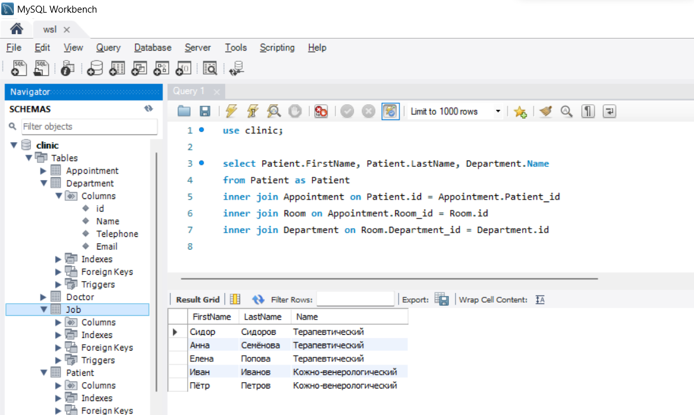
- Обновить дату приёма для пациента Ивана Иванова на 2022-02-09.
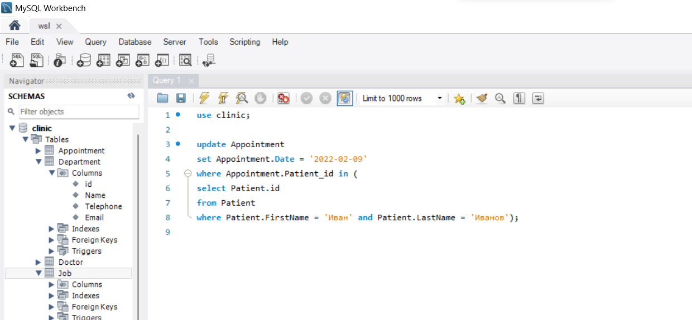
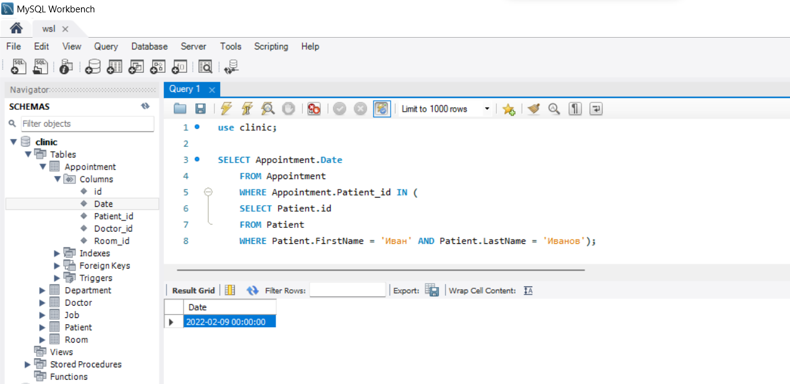
- Удалить врача Андрея Быкова и все его приёмы.
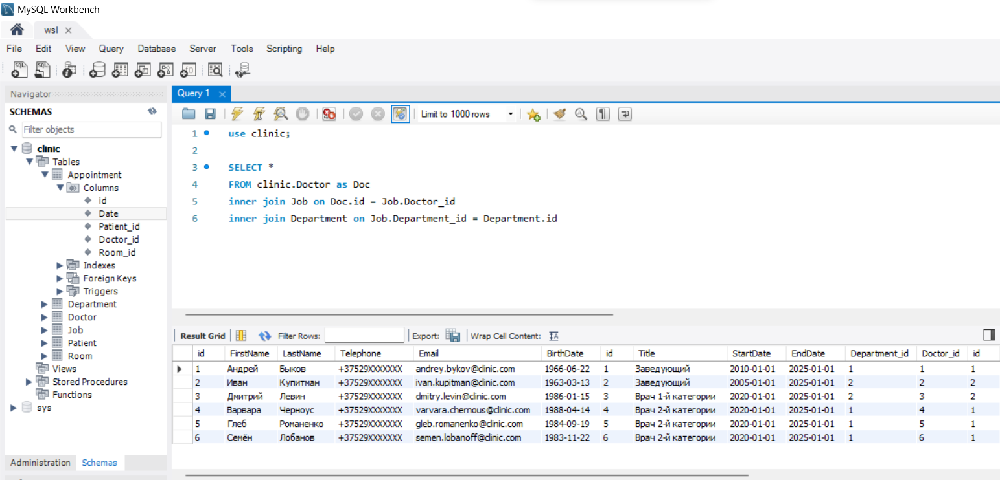
- Добавить нового врача Фила Ричардса и новую пациентку Василису Васильеву и записать её к Филу Ричардсу на приём на 2022-02-14.
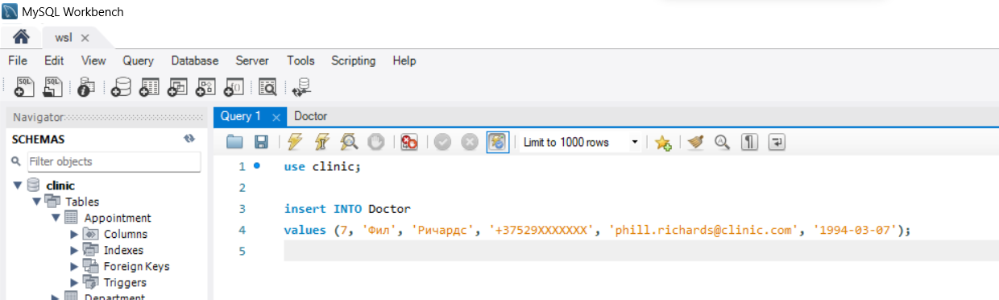
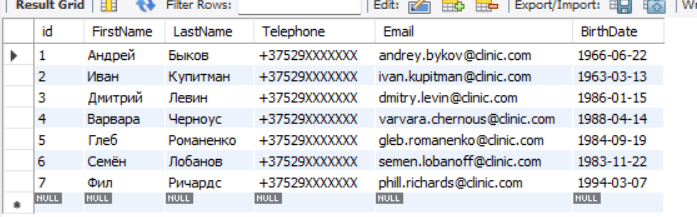
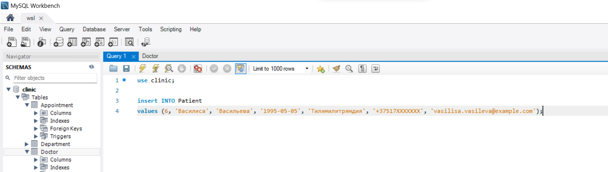
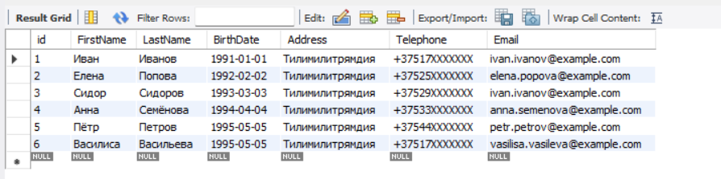
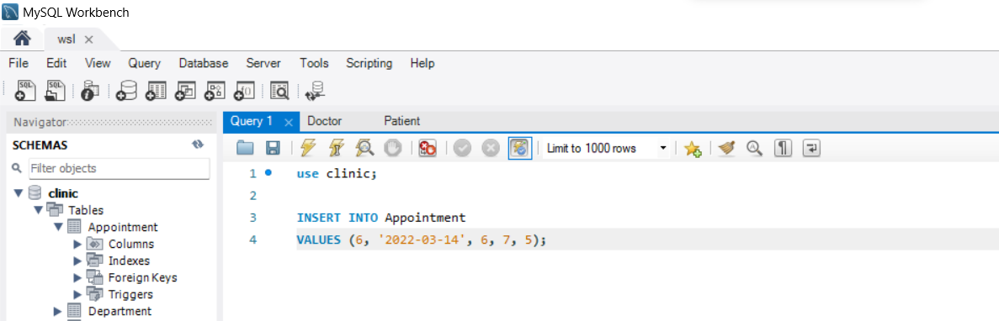
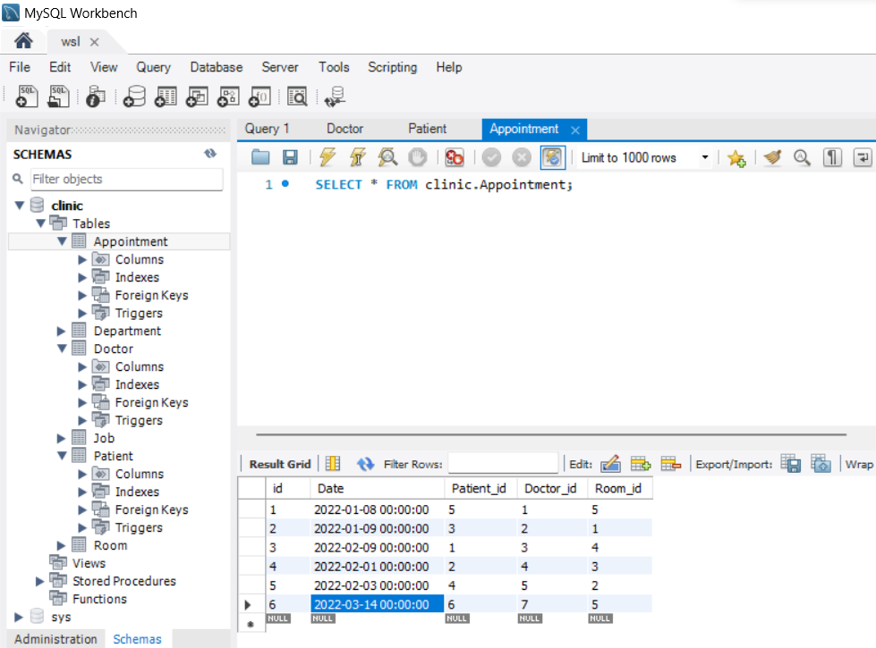
## 6. Восстановить базу данных clinic из бэкапа и проверить, что данные соответствуют состоянию базы данных до внесенных в предыдущем задании изменений.
```
dmitry@DESKTOP-7F6PRUI:~$ sudo mysql -u root -p clinic < /mnt/f/clinic_backup.sql
```
```
Новой пациентки Василисы нет, значит все ок, бэкап восстановлен
```
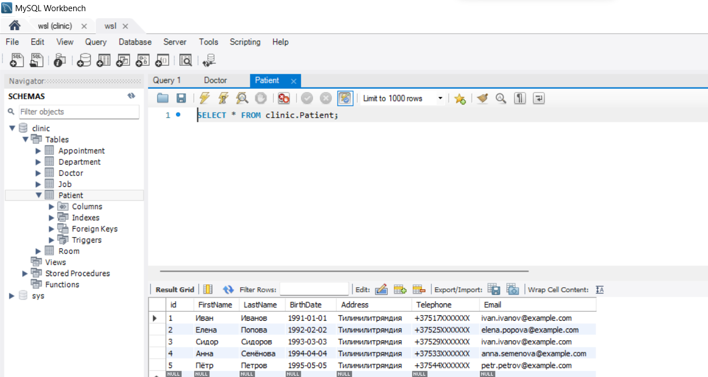
## 7. Установить MongoDB
```
dmitry@DESKTOP-7F6PRUI:~$ sudo apt-get install gnupg curl
dmitry@DESKTOP-7F6PRUI:~$ curl -fsSL https://pgp.mongodb.com/server-7.0.asc | \
   sudo gpg -o /usr/share/keyrings/mongodb-server-7.0.gpg \
   --dearmor
dmitry@DESKTOP-7F6PRUI:~$ sudo apt-get update
dmitry@DESKTOP-7F6PRUI:~$ sudo apt-get install -y mongodb-org
dmitry@DESKTOP-7F6PRUI:~$  sudo systemctl start mongod.service
```

## 8. Создать БД clinic и наполнить её данными используя скрипты из https://github.com/tms-dos17-onl/_sandbox/tree/main/lecture18/mongo/initdb.d.
```
test> load("/home/dmitry/initdb.d/schema.js");
true
test> use clinic
switched to db clinic
clinic> load("/home/dmitry/initdb.d/data.js");
true
```
## 9. Написать выборочно 3 запроса из задания 5 для MongoDB используя mongosh команды.
```
Добавить нового врача Фила Ричардса и новую пациентку Василису Васильеву и записать её к Филу Ричардсу на приём на 2022-02-14.
clinic>  doctor = db.doctor.insertOne({ "id": 7, "Email": "phill.richards@clinic.com", "LastName": "Ричардс", "BirthDate": "1991-05-05", "FirstName": "Фил", "Telephone": "+37529XXXXXXX" })
{
  acknowledged: true,
  insertedId: ObjectId("64fafba8db568db07c832d20")
}
clinic> patient = db.patient.insertOne({ "id": 6, "Email": "vasilisa.vasileva@example.com", "Address": "Тилимилитрямдия", "LastName": "Васильева", "BirthDate": "1995-05-05", "FirstName": "Василиса", "Telephone": "+37517XXXXXXX" })
{
  acknowledged: true,
  insertedId: ObjectId("64fafbe6db568db07c832d21")
}
clinic> db.appointment.insertOne({ "id": 6, "Date": "2022-03-14 00:00:00.000000", "Room_id": 5, "Doctor_id": doctor.id, "Patient_id": patient.id })
{
  acknowledged: true,
  insertedId: ObjectId("64f88d72d0178f5698d31b6c")
}
```
```
Обновить дату приёма для пациента Ивана Иванова на 2022-02-09
clinic> patient = db.patient.findOne({ "FirstName": "Иван", "LastName": "Иванов" })
{
  _id: ObjectId("64faf44177e61955b398473d"),
  id: 1,
  Email: 'ivan.ivanov@example.com',
  Address: 'Тилимилитрямдия',
  LastName: 'Иванов',
  BirthDate: '1991-01-01',
  FirstName: 'Иван',
  Telephone: '+37517XXXXXXX'
}
clinic>  db.appointment.updateOne({"Patient_id": patient.id}, {$set: {Date : "2022-02-09 00:00:00.000000"}})
{
  acknowledged: true,
  insertedId: null,
  matchedCount: 1,
  modifiedCount: 1,
  upsertedCount: 0
}
clinic>
```
** не обязательны к выполнению. Задачи на интерес