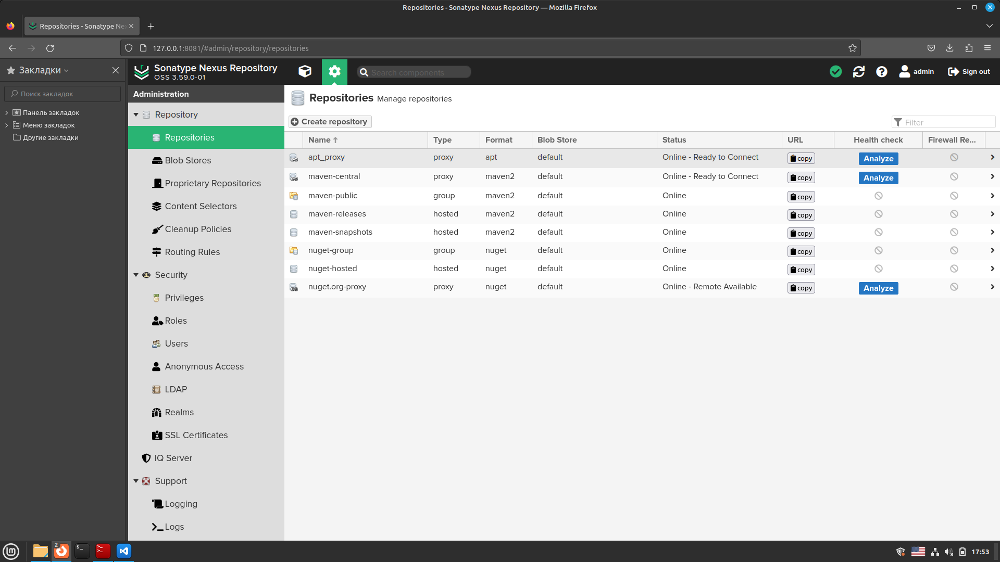
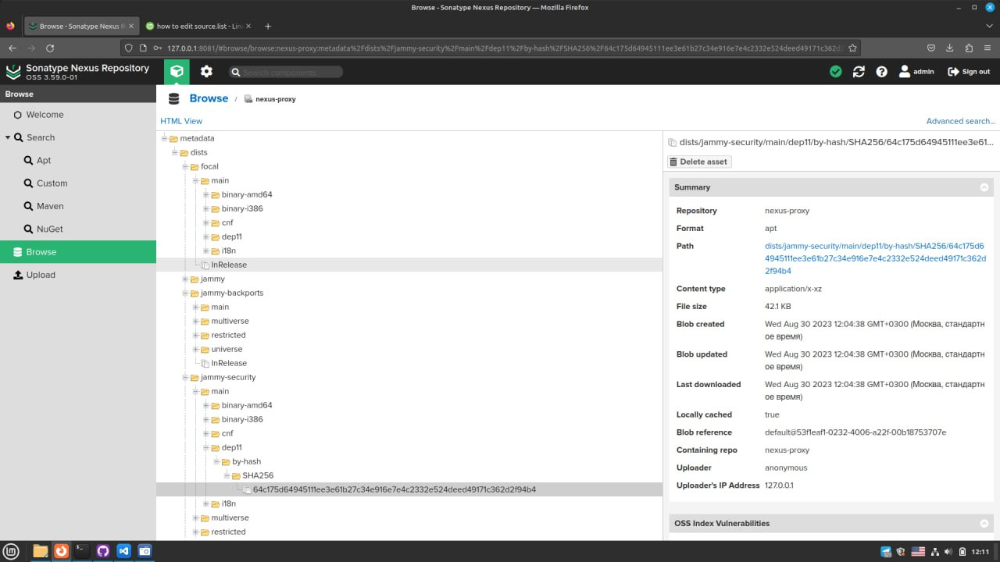

## 1. Добавить новый диск к виртуальной машине и проверить, что система видит его.
```
[dmitry@localhost ~]$ lsblk
NAME            MAJ:MIN RM  SIZE RO TYPE MOUNTPOINT
fd0               2:0    1    4K  0 disk
sda               8:0    0   20G  0 disk
├─sda1            8:1    0    1G  0 part /boot
└─sda2            8:2    0   19G  0 part
  ├─centos-root 253:0    0   17G  0 lvm  /
  └─centos-swap 253:1    0    2G  0 lvm  [SWAP]
sdb               8:16   0    5G  0 disk
sr0              11:0    1 1024M  0 rom
``` 
## 2. Вывести в консоль информацию по текущему размеру файловой системы.
```
[dmitry@localhost ~]$ sudo lshw -class disk
[sudo] пароль для dmitry:
  *-cdrom
       description: DVD reader
       product: Virtual CD/ROM
       vendor: Msft
       physical id: 0.0.0
       bus info: scsi@1:0.0.0
       logical name: /dev/cdrom
       logical name: /dev/sr0
       version: 1.0
       capabilities: removable audio dvd
       configuration: ansiversion=5 status=nodisc
  *-disk
       description: SCSI Disk
       product: Virtual Disk
       vendor: Msft
       physical id: 0.0.0
       bus info: scsi@2:0.0.0
       logical name: /dev/sda
       version: 1.0
       size: 20GiB (21GB)
       capabilities: partitioned partitioned:dos
       configuration: ansiversion=5 logicalsectorsize=512 sectorsize=4096 signature=000b993f
  *-disk
       description: SCSI Disk
       product: Virtual Disk
       vendor: Msft
       physical id: 0.1.0
       bus info: scsi@3:0.1.0
       logical name: /dev/sdb
       version: 1.0
       size: 5GiB (5368MB)
       configuration: ansiversion=5 logicalsectorsize=512 sectorsize=4096
``` 
## 3. Расширить корневую файловую систему за счёт добавленного диска.
```
[dmitry@localhost ~]$ sudo pvcreate /dev/sdb
[sudo] пароль для dmitry:
  Physical volume "/dev/sdb" successfully created.

[dmitry@localhost ~]$ sudo pvs
  PV         VG     Fmt  Attr PSize   PFree
  /dev/sda2  centos lvm2 a--  <19,00g    0
  /dev/sdb          lvm2 ---    5,00g 5,00g

[dmitry@localhost ~]$ sudo vgs
  VG     #PV #LV #SN Attr   VSize   VFree
  centos   1   2   0 wz--n- <19,00g    0

[dmitry@localhost ~]$ sudo vgextend centos /dev/sdb
  Volume group "centos" successfully extended

[dmitry@localhost ~]$ sudo pvs
  PV         VG     Fmt  Attr PSize   PFree
  /dev/sda2  centos lvm2 a--  <19,00g     0
  /dev/sdb   centos lvm2 a--   <5,00g <5,00g

[dmitry@localhost ~]$ sudo vgs
  VG     #PV #LV #SN Attr   VSize  VFree
  centos   2   2   0 wz--n- 23,99g <5,00g

[dmitry@localhost ~]$ sudo lvextend -l +100%FREE /dev/mapper/centos/root
[sudo] пароль для dmitry:
  Size of logical volume centos/root changed from <17,00 GiB (4351 extents) to 21,99 GiB (5630 extents).
  Logical volume centos/root successfully resized.

[dmitry@localhost ~]$ sudo xfs_growfs /dev/mapper/centos-root
meta-data=/dev/mapper/centos-root isize=512    agcount=4, agsize=1113856 blks
         =                       sectsz=4096  attr=2, projid32bit=1
         =                       crc=1        finobt=0 spinodes=0
data     =                       bsize=4096   blocks=4455424, imaxpct=25
         =                       sunit=0      swidth=0 blks
naming   =version 2              bsize=4096   ascii-ci=0 ftype=1
log      =internal               bsize=4096   blocks=2560, version=2
         =                       sectsz=4096  sunit=1 blks, lazy-count=1
realtime =none                   extsz=4096   blocks=0, rtextents=0
data blocks changed from 4455424 to 5765120
``` 
## 4. Вывести информацию по новому размеру файловой системы.
```
[dmitry@localhost ~]$ df -h
Файловая система        Размер Использовано  Дост Использовано% Cмонтировано в
devtmpfs                  876M            0  876M            0% /dev
tmpfs                     887M            0  887M            0% /dev/shm
tmpfs                     887M         9,1M  878M            2% /run
tmpfs                     887M            0  887M            0% /sys/fs/cgroup
/dev/mapper/centos-root    22G         1,5G   21G            7% /
/dev/sda1                1014M         150M  865M           15% /boot
tmpfs                     178M            0  178M            0% /run/user/1000
tmpfs                     178M            0  178M            0% /run/user/0

[dmitry@localhost ~]$ lsblk
NAME            MAJ:MIN RM  SIZE RO TYPE MOUNTPOINT
fd0               2:0    1    4K  0 disk
sda               8:0    0   20G  0 disk
├─sda1            8:1    0    1G  0 part /boot
└─sda2            8:2    0   19G  0 part
  ├─centos-root 253:0    0   22G  0 lvm  /
  └─centos-swap 253:1    0    2G  0 lvm  [SWAP]
sdb               8:16   0    5G  0 disk
└─centos-root   253:0    0   22G  0 lvm  /
sr0              11:0    1 1024M  0 rom
``` 
## 5. Вывести в консоль текущую рабочую директорию.
```
[dmitry@localhost ~]$ pwd
/home/dmitry
``` 
## 6. Вывести в консоль все файлы из домашней директории.
```
[dmitry@localhost ~]$ ls -la ~
итого 16
drwx------. 2 dmitry dmitry  83 июн 29 16:17 .
drwxr-xr-x. 3 root   root    20 июн 29 15:45 ..
-rw-------. 1 dmitry dmitry 152 июн 29 16:17 .bash_history
-rw-r--r--. 1 dmitry dmitry  18 апр  1  2020 .bash_logout
-rw-r--r--. 1 dmitry dmitry 193 апр  1  2020 .bash_profile
-rw-r--r--. 1 dmitry dmitry 231 апр  1  2020 .bashrc
``` 
## 7. Построить маршрут до google.com при помощи утилиты traceroute.
```
dmitry@DESKTOP-7F6PRUI:~$ dmitry@DESKTOP-7F6PRUI:~$ traceroute google.com
traceroute to google.com (142.250.186.142), 30 hops max, 60 byte packets
 1  DESKTOP-7F6PRUI (172.31.16.1)  0.617 ms  0.571 ms  0.540 ms ms
 2  10.240.11.254 (10.240.11.254)  21.458 ms  21.121 ms  21.436 ms
 3  10.240.0.10 (10.240.0.10)  6.907 ms  6.900 ms  6.893 ms  6.915 ms  5.706 ms
 4  mm-73-144-57-86.static.mgts.by (86.57.144.73)  6.920 ms  6.915 ms  5.706 ms
 5  3-130-57-86-static.mgts.by (86.57.130.3)  6.612 ms  6.584 ms  6.573 ms
 6  core1.net.belpak.by (93.85.80.45)  13.296 ms  28.135 ms  28.104 ms
 7  ie1.net.belpak.by (93.85.80.38)  28.093 ms  11.423 ms  11.400 ms
 8  asbr9.net.belpak.by (93.85.80.238)  9.156 ms  9.149 ms  9.142 ms
 9  74.125.146.96 (74.125.146.96)  12.313 ms  15.186 ms  20.657 ms0.37.211 (142.250.37.211)  13.276 ms
10  108.170.250.210 (108.170.250.210)  13.359 ms  21.244 ms 142.250.37.211 (142.250.37.211)  13.276 ms
11  142.251.245.209 (142.251.245.209)  34.103 ms *  30.466 ms0 (209.85.241.70)  29.849 ms 192.178.73.110 (192.12  108.1712  108.17012  108.170.212  108.170.228.12  108.170.228.254 (108.170.228.254)  30.382 ms 209.85.241.70 (209.85.241.70)  29.849 ms 192.178.73.110 (192.178.73.110)  83.822 ms108.170.251.129 (108.170.25113  108.170.251.129 (108.170.251.129)  83.782 ms  83.776 ms  83.771 ms
14  142.250.214.197 (142.250.214.197)  83.747 ms  83.741 ms  83.737 ms
15  fra24s07-in-f14.1e100.net (142.250.186.142)  83.794 ms  83.790 ms  83.508 ms
``` 
## 8. Установить Sonatype Nexus OSS по следующей инструкции, а именно:
- установку произвести в директорию /opt/nexus.
- запустить приложение от отдельного пользователя nexus.
- реализовать systemd оболочку для запуска приложения как сервис.
```
dmitry@Mint-Study:~$ sudo apt-get update
dmitry@Mint-Study:~$ sudo apt install openjdk-8-jre-headless
dmitry@Mint-Study:/opt$ sudo wget https://download.sonatype.com/nexus/3/latest-unix.tar.gz
dmitry@Mint-Study:/opt$ sudo tar -zxvf latest-unix.tar.gz
dmitry@Mint-Study:/opt$ sudo mv /opt/nexus-3.59.0-01/ /opt/nexus
dmitry@Mint-Study:/opt$ sudo adduser nexus
dmitry@Mint-Study:/opt$ sudo visudo
dmitry@Mint-Study:/opt$ sudo chown -R nexus:nexus /opt/nexus
dmitry@Mint-Study:/opt$ sudo chown -R nexus:nexus /opt/sonatype-work
dmitry@Mint-Study:/opt$ sudo nano /opt/nexus/bin/nexus.rc
dmitry@Mint-Study:/opt$ sudo cat /opt/nexus/bin/nexus.rc
run_as_user="nexus"
dmitry@Mint-Study:/opt$ sudo nano /etc/systemd/system/nexus.service
dmitry@Mint-Study:/opt$ sudo cat /etc/systemd/system/nexus.service
[Unit]
Description=nexus service
After=network.target

[Service]
Type=forking
LimitNOFILE=65536
ExecStart=/opt/nexus/bin/nexus start
ExecStop=/opt/nexus/bin/nexus stop
User=nexus
Restart=on-abort

[Install]
WantedBy=multi-user.target

dmitry@Mint-Study:/opt$ sudo systemctl start nexus
dmitry@Mint-Study:/opt$ sudo systemctl enable nexus
dmitry@Mint-Study:/opt$ sudo systemctl status nexus
Created symlink /etc/systemd/system/multi-user.target.wants/nexus.service → /etc/systemd/system/nexus.service.

● nexus.service - nexus service
     Loaded: loaded (/etc/systemd/system/nexus.service; enabled; vendor preset: enabled)
     Active: active (running) since Mon 2023-08-28 17:15:33 MSK; 54s ago
   Main PID: 8717 (java)
      Tasks: 45 (limit: 2122)
     Memory: 1.5G
        CPU: 1min 43.360s
     CGroup: /system.slice/nexus.service
             └─8717 /usr/lib/jvm/java-1.8.0-openjdk-amd64/bin/java -server -Dinstall4j.jvmDir=/usr/lib/jvm/java-1.8.0-openjdk-amd64 -Dexe4j.moduleName=/opt/nexus/bin/nexus -XX:+UnlockDiagnosticVMOptions -Dinstall4j.launcherId=245 -Dinsta>

авг 28 17:15:32 Mint-Study systemd[1]: Starting nexus service...
авг 28 17:15:33 Mint-Study nexus[8417]: Starting nexus
авг 28 17:15:33 Mint-Study systemd[1]: Started nexus service.
``` 
## 9. Создать в Nexus proxy репозиторий для пакетов ОС и разрешить анонимный доступ.

## 10. Поменять для текущей VM основной репозиторий пакетов на созданный ранее proxy в Nexus.
```
dmitry@Mint-Study:/opt$ sudo nano /etc/apt/sources.list
deb http://localhost:8081/repository/apt_proxy/ jammy main restricted
``` 
## 11. Выполнить установку пакета snap и убедиться, что на proxy репозитории в Nexus появились пакеты.
```
dmitry@Mint-Study:/opt$ sudo apt install snap
```

## 12. (**) На основании шагов из предыдущих пунктов создать DEB/RPM пакет для установки Nexus и загрузить его в Nexus.

** не обязательны к выполнению. Задачи на интерес
